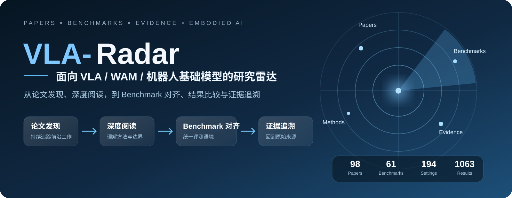
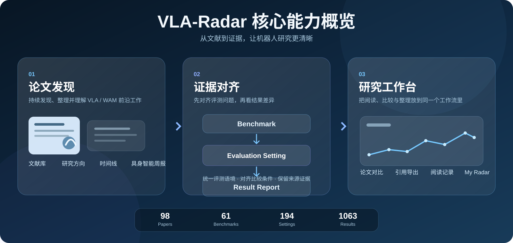

# VLA-Radar

<p align="center">
  
</p>

<p align="center">
  <strong>从论文发现、深度阅读，到 Benchmark 对齐、结果比较与证据追溯。</strong>
</p>

<p align="center">
  <a href="https://invoidstar.github.io/VLA-Radar/"><strong>🌐 在线访问</strong></a>
  ·
  <a href="https://github.com/invoidstar/VLA-Radar/actions/workflows/site.yml">构建状态</a>
  ·
  <a href="CHANGELOG.md">更新记录</a>
</p>

<p align="center">
  
  
  
</p>

---

## 项目简介

**VLA-Radar** 是一个面向 **Vision-Language-Action、World Action Model 与机器人基础模型** 的开放研究雷达。

它希望解决的不只是“有哪些论文”，而是进一步回答：

- 这篇工作真正做了什么？
- 它和已有方法相比改变了什么？
- 实验结果是在什么评测条件下得到的？
- 不同论文中的结果是否真的可以直接比较？
- 一个结论最终能否回到原始论文、表格与证据来源？

因此，VLA-Radar 将 **文献阅读、Benchmark、结果证据与研究工作流** 放在同一个网站中持续维护。

---

## 核心能力

<p align="center">
  
</p>

### 📚 论文发现与深度阅读

持续整理 VLA / WAM / 机器人基础模型相关研究，并提供：

- 文献库与研究方向
- 论文时间线
- 深度阅读笔记
- 发表与版本更新追踪
- 官方项目主页与开源代码入口
- 具身智能周报

### 📊 Benchmark 与证据对齐

VLA-Radar 不将不同评测条件下的数字简单堆成一个总榜。

默认按照：

```text
Benchmark
    ↓
Evaluation Setting
    ↓
Result Report
```

组织结果。

其中 **Evaluation Setting 只由评测协议决定**。训练数据、训练 recipe、base model 和来源论文保留在结果中展示，但不会因此人为拆成新的 Setting。

这样可以在保留差异的同时，更清楚地判断：

> **这些数字究竟是不是在回答同一个评测问题。**

### 🧭 Benchmark 搜索与分类

当前 Benchmark 支持：

- 关键词搜索
- Focus 分类
- Simulation / Real Robot / Mixed 环境筛选
- Long-horizon、Memory、Tactile、Robustness / OOD、Latency / Efficiency 等标签组合

帮助快速找到真正关心的评测方向。

### 🛠 研究工作台

网站同时提供：

- 论文对比
- Benchmark 结果分析
- 引用与 CSV 导出
- 更新中心
- Evidence Coverage
- My Radar
- 本地阅读记录

其中收藏、阅读状态与个人筛选偏好只保存在浏览器本地，不上传到公共仓库。

---

## 当前覆盖

| 内容 | 当前规模 |
|---|---:|
| 论文 | **98** |
| Benchmark | **61** |
| Evaluation Setting | **194** |
| 结果记录 | **1063** |

这些数字会随着每周维护继续增长。

VLA-Radar 关注的不只是收录数量，更强调：

> **每一条结果都尽可能保留评测条件、来源论文与原始证据。**

---

## 证据原则

VLA-Radar 在整理结果时遵循几个基本原则：

**先看协议，再看排名。**  
任务集合、评测条件或指标不同的结果，不会被强行合并成统一排名。

**缺失值不是 0。**  
论文没有报告的数据保持缺失，不进行猜测或补值。

**同一个方法可以有多条结果。**  
不同论文、不同训练数据或不同 recipe 报告出的结果都会被保留，而不是只选择最高分。

**结果可以回到来源。**  
尽量保留来源论文、表格 / 章节定位、版本与核验信息。

**资源链接和证据来源分开。**  
项目主页与代码仓库只收录可确认的作者 / 官方资源；它们用于访问项目，不替代论文原文、表格和实验依据。

**结构校验不等于科学结论验证。**  
CI 可以保证数据结构和网站一致性，但论文中的科学结论仍以原始来源为准。

---

## V3.0

V3.0 标志着 VLA-Radar 从一个论文阅读网站，进一步发展为一个相对完整的 **VLA Research Radar**。

目前主要的信息链路已经稳定：

```text
发现论文
  ↓
理解工作
  ↓
找到 Benchmark
  ↓
对齐 Evaluation Setting
  ↓
比较 Result Report
  ↓
追溯原始 Evidence
```

项目现已进入稳定维护阶段。后续默认不再为了增加功能而增加功能，而是持续提高：

- 文献覆盖率
- 阅读与总结质量
- Benchmark 与结果完整性
- 证据可追溯性
- 周更稳定性

---

## 访问

🌐 **在线网站**

https://invoidstar.github.io/VLA-Radar/

📦 **GitHub**

https://github.com/invoidstar/VLA-Radar

---

## 说明

VLA-Radar 是一个独立的研究阅读与证据整理项目，并非任何 Benchmark 的官方排行榜。

网站中的跨论文结果仍可能受到训练数据、模型规模、计算预算、checkpoint 与实现细节等因素影响。即使 Evaluation Setting 已对齐，也不代表所有训练条件完全公平。

项目仅使用公开研究资料；无法可靠确认的信息保持未知，不进行猜测。

---

<p align="center">
  <strong>READ PAPERS. FOLLOW EVIDENCE.</strong>
</p>
